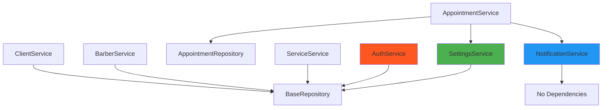

# API Interna - Servicios - Barber Manager Pro

Documentación completa de la API interna de servicios (Service Layer) del sistema de gestión de turnos para barberías.

---

## Tabla de Contenidos

- [Introducción](#introducción)
- [AppointmentService](#appointmentservice)
- [ClientService](#clientservice)
- [BarberService](#barberservice)
- [ServiceService](#serviceservice)
- [AuthService](#authservice)
- [NotificationService](#notificationservice)
- [SettingsService](#settingsservice)
- [Dependencias entre Servicios](#dependencias-entre-servicios)

---

## Introducción

La capa de servicios encapsula toda la **lógica de negocio** del sistema. Cada servicio es una clase con métodos estáticos/de clase que realizan operaciones complejas, validaciones y coordinación de repositorios.

### Convenciones

- **Métodos**: Todos son `@classmethod` o `@staticmethod`
- **Parámetros**: Primer parámetro siempre es `db: Session` (inyección de dependencia)
- **Retornos**: La mayoría retorna `Tuple[Optional[Entity], Optional[str]]`
  - `(entity, None)` = Éxito
  - `(None, "error message")` = Error
- **Validaciones**: Antes de acceder a la BD
- **Transacciones**: Manejadas por el llamador (vistas)

---

## AppointmentService

Gestión completa de turnos: creación, actualización, cancelación, cálculo de disponibilidad y detección de conflictos.

**Ubicación**: `services/appointment_service.py`

---

### Configuración

```python
DEFAULT_START_HOUR = 12  # Fallback si no hay setting
DEFAULT_END_HOUR = 20
SLOT_INTERVAL_MINUTES = 15
```

---

### Métodos

#### `get_business_hours(db: Session) -> Tuple[int, int]`

Obtiene horarios de atención desde la configuración dinámica.

**Parámetros**:
- `db`: Sesión de base de datos

**Retorna**:
- `Tuple[int, int]`: `(hora_inicio, hora_fin)` en formato 0-23

**Ejemplo**:
```python
from services.appointment_service import Appointment Service

with get_db() as db:
    start, end = AppointmentService.get_business_hours(db)
    print(f"Horario: {start}:00 - {end}:00")
    # Output: Horario: 12:00 - 20:00
```

---

#### `get_all_time_slots(db: Session = None) -> List[Tuple[int, int]]`

Genera todos los slots posibles del día en intervalos de 15 minutos.

**Parámetros**:
- `db`: Sesión de base de datos (opcional)

**Retorna**:
- `List[Tuple[int, int]]`: Lista de `(hora, minuto)`

**Ejemplo**:
```python
slots = AppointmentService.get_all_time_slots(db)
# [(12, 0), (12, 15), (12, 30), ..., (19, 45)]
```

**Uso**: Renderizar todos los slots en la agenda UI.

---

#### `get_appointments_for_date(db: Session, target_date: date, barber_id: Optional[int] = None) -> List[Appointment]`

Obtiene todos los turnos de una fecha específica.

**Parámetros**:
- `db`: Sesión de base de datos
- `target_date`: Fecha a consultar
- `barber_id`: Filtrar por barbero (opcional)

**Retorna**:
- `List[Appointment]`: Turnos de la fecha

**Ejemplo**:
```python
from datetime import date

target = date(2026, 1, 25)
appointments = AppointmentService.get_appointments_for_date(db, target)

# Filtrar por barbero
barber_appointments = AppointmentService.get_appointments_for_date(
    db, target, barber_id=1
)
```

**Uso**: Vista de agenda diaria.

---

#### `get_available_slots(db: Session, target_date: date, service_duration: int, barber_id: int) -> List[Tuple[int, int, bool]]`

Calcula disponibilidad de cada slot considerando la duración del servicio.

**Parámetros**:
- `db`: Sesión de base de datos
- `target_date`: Fecha objetivo
- `service_duration`: Duración del servicio en minutos
- `barber_id`: ID del barbero

**Retorna**:
- `List[Tuple[int, int, bool]]`: `(hora, minuto, is_available)`

**Algoritmo**:
```python
# Para cada slot:
#   1. Calcular end_time = slot + service_duration
#   2. Verificar que end_time <= business_hours_end
#   3. Buscar turnos existentes en ese rango
#   4. Si hay overlap => no disponible
```

**Ejemplo**:
```python
from datetime import date

# Servicio de 30 minutos
slots = AppointmentService.get_available_slots(
    db, 
    target_date=date(2026, 1, 25),
    service_duration=30,
    barber_id=1
)

for hour, minute, available in slots:
    status = "✓" if available else "✗"
    print(f"{status} {hour:02d}:{minute:02d}")

# Output:
# ✓ 12:00
# ✗ 12:15  (ocupado)
# ✗ 12:30  (ocupado)
# ✓ 12:45
```

**Uso**: Mostrar slots disponibles al crear turno.

---

#### `check_slot_availability(db: Session, start_time: datetime, end_time: datetime, barber_id: int, exclude_appointment_id: Optional[int] = None) -> bool`

Verifica si un slot específico está disponible.

**Parámetros**:
- `db`: Sesión de base de datos
- `start_time`: Hora de inicio propuesta
- `end_time`: Hora de fin propuesta
- `barber_id`: ID del barbero
- `exclude_appointment_id`: Excluir turno (para edición)

**Retorna**:
- `bool`: `True` si está disponible

**Lógica de Detección de Conflictos**:
```python
# Buscar turnos que se solapen:
conflicting = db.query(Appointment).filter(
    Appointment.barber_id == barber_id,
    Appointment.start_time < end_time,  # Empieza antes de que termine propuesto
    Appointment.end_time > start_time,  # Termina después de que empiece propuesto
    Appointment.status != 'cancelled'
).all()

return len(conflicting) == 0
```

**Ejemplo**:
```python
from datetime import datetime

start = datetime(2026, 1, 25, 14, 0)  # 14:00
end = datetime(2026, 1, 25, 14, 30)   # 14:30

is_available = AppointmentService.check_slot_availability(
    db, start, end, barber_id=1
)

if is_available:
    print("Slot disponible para agendar")
else:
    print("Slot ocupado, elegir otro horario")
```

---

#### `create_appointment(db: Session, client_id: int, service_id: int, barber_id: int, start_time: datetime, sync_to_google: bool = True) -> Tuple[Optional[Appointment], Optional[str]]`

Crea un nuevo turno con validación completa.

**Parámetros**:
- `db`: Sesión de base de datos
- `client_id`: ID del cliente
- `service_id`: ID del servicio
- `barber_id`: ID del barbero
- `start_time`: Hora de inicio
- `sync_to_google`: Sincronizar con Google Calendar (stub)

**Retorna**:
- `Tuple[Optional[Appointment], Optional[str]]`

**Validaciones**:
1. Cliente existe
2. Servicio existe y está activo
3. Barbero existe y está activo
4. Horario dentro de business hours
5. No hay conflictos de horario

**Ejemplo**:
```python
from datetime import datetime

appointment, error = AppointmentService.create_appointment(
    db,
    client_id=5,
    service_id=1,  # Corte (30 min)
    barber_id=1,
    start_time=datetime(2026, 1, 25, 14, 30)
)

if appointment:
    print(f"Turno creado: #{appointment.id}")
else:
    print(f"Error: {error}")
    # Possible errors:
    # - "Cliente no encontrado"
    # - "Servicio no encontrado o inactivo"
    # - "Barbero no encontrado o inactivo"
    # - "El horario seleccionado no está disponible"
```

---

#### `update_appointment_status(db: Session, appointment_id: int, new_status: str) -> Tuple[Optional[Appointment], Optional[str]]`

Actualiza el estado de un turno.

**Parámetros**:
- `db`: Sesión de base de datos
- `appointment_id`: ID del turno
- `new_status`: Nuevo estado (`'pending'`, `'confirmed'`, `'cancelled'`)

**Retorna**:
- `Tuple[Optional[Appointment], Optional[str]]`

**Ejemplo**:
```python
# Confirmar turno
appointment, error = AppointmentService.update_appointment_status(
    db, appointment_id=42, new_status='confirmed'
)

# Cancelar turno
appointment, error = AppointmentService.update_appointment_status(
    db, appointment_id=42, new_status='cancelled'
)
```

---

#### `delete_appointment(db: Session, appointment_id: int) -> Tuple[bool, Optional[str]]`

Elimina un turno permanentemente.

**Parámetros**:
- `db`: Sesión de base de datos
- `appointment_id`: ID del turno

**Retorna**:
- `Tuple[bool, Optional[str]]`: `(éxito, error)`

**Ejemplo**:
```python
success, error = AppointmentService.delete_appointment(db, 42)
if success:
    print("Turno eliminado")
else:
    print(f"Error: {error}")
```

---

## ClientService

Gestión completa de clientes: CRUD, búsqueda y validaciones.

**Ubicación**: `services/client_service.py`

---

### Métodos

#### `get_all_clients(db: Session) -> List[Client]`

Obtiene todos los clientes ordenados alfabéticamente.

**Ejemplo**:
```python
clients = ClientService.get_all_clients(db)
for client in clients:
    print(f"{client.name} ({client.email})")
```

---

#### `get_client_by_id(db: Session, client_id: int) -> Optional[Client]`

Obtiene un cliente por ID.

**Ejemplo**:
```python
client = ClientService.get_client_by_id(db, 5)
if client:
    print(f"Cliente: {client.name}")
```

---

#### `search_clients(db: Session, search_term: str) -> List[Client]`

Busca clientes por nombre o teléfono (máximo 10 resultados).

**Parámetros**:
- `db`: Sesión de base de datos
- `search_term`: Texto a buscar (sanitizado automáticamente)

**Retorna**:
- `List[Client]`: Hasta 10 clientes que coinciden

**Ejemplo**:
```python
# Buscar por nombre
results = ClientService.search_clients(db, "Juan")

# Buscar por teléfono
results = ClientService.search_clients(db, "1234")

for client in results:
    print(f"{client.name} - {client.phone}")
```

**Sanitización**: Remove caracteres SQL especiales (`%`, `_`, `\`)

---

#### `create_client(db: Session, name: str, email: str, phone: Optional[str] = None, notes: Optional[str] = None) -> Tuple[Optional[Client], Optional[str]]`

Crea un nuevo cliente con validaciones.

**Parámetros**:
- `db`: Sesión de base de datos
- `name`: Nombre completo
- `email`: Email (debe ser único)
- `phone`: Teléfono (opcional)
- `notes`: Notas (opcional)

**Validaciones**:
- Nombre mínimo 2 caracteres
- Email formato válido y único
- Teléfono formato válido (si se proporciona)

**Ejemplo**:
```python
client, error = ClientService.create_client(
    db,
    name="Juan Pérez",
    email="juan.perez@example.com",
    phone="+54 9 11 1234-5678",
    notes="Prefiere corte bajo"
)

if client:
    print(f"Cliente creado: #{client.id}")
else:
    print(f"Error: {error}")
    # Possible errors:
    # - "El nombre debe tener al menos 2 caracteres"
    # - "Email inválido"
    # - "Ya existe un cliente con ese email"
    # - "Formato de teléfono inválido"
```

---

#### `update_client(db: Session, client_id: int, name: Optional[str] = None, email: Optional[str] = None, phone: Optional[str] = None, notes: Optional[str] = None) -> Tuple[Optional[Client], Optional[str]]`

Actualiza campos de un cliente existente.

**Parámetros**: Solo los campos que se desean modificar

**Ejemplo**:
```python
# Actualizar solo teléfono
client, error = ClientService.update_client(
    db, client_id=5, phone="+54 9 11 9999-9999"
)

# Actualizar múltiples campos
client, error = ClientService.update_client(
    db,
    client_id=5,
    name="Juan Carlos Pérez",
    notes="Actualizado: prefiere fade"
)
```

---

#### `delete_client(db: Session, client_id: int) -> Tuple[bool, Optional[str]]`

Elimina un cliente (solo si NO tiene turnos asociados).

**Validación**: Previene eliminar clientes con historial.

**Ejemplo**:
```python
success, error = ClientService.delete_client(db, 5)
if not success:
    print(error)  # "No se puede eliminar un cliente con turnos asociados"
```

---

## BarberService

Gestión de personal: CRUD de barberos, activación/desactivación y estadísticas.

**Ubicación**: `services/barber_service.py`

---

### Métodos

#### `get_all_barbers(db: Session, include_inactive: bool = False) -> List[Barber]`

Obtiene todos los barberos ordenados por nombre.

**Ejemplo**:
```python
# Solo activos
barbers = BarberService.get_all_barbers(db)

# Incluir inactivos
all_barbers = BarberService.get_all_barbers(db, include_inactive=True)
```

---

#### `create_barber(db: Session, name: str, color: str = "#2196F3") -> Tuple[Optional[Barber], Optional[str]]`

Crea un nuevo barbero.

**Parámetros**:
- `name`: Nombre del barbero
- `color`: Color hex para identificación visual

**Validaciones**:
- Nombre mínimo 2 caracteres
- Color formato `#RRGGBB`
- Nombre único (case-insensitive)

**Ejemplo**:
```python
barber, error = BarberService.create_barber(
    db,
    name="Carlos López",
    color="#FF5722"
)

if barber:
    print(f"Barbero creado: #{barber.id}")
```

---

#### `update_barber(db: Session, barber_id: int, name: Optional[str] = None, color: Optional[str] = None) -> Tuple[Optional[Barber], Optional[str]]`

Actualiza nombre y/o color.

**Ejemplo**:
```python
# Cambiar solo color
barber, error = BarberService.update_barber(
    db, barber_id=1, color="#9C27B0"
)
```

---

#### `toggle_active(db: Session, barber_id: int) -> Tuple[Optional[Barber], Optional[str]]`

Activa o desactiva un barbero con validaciones.

**Validaciones al desactivar**:
- No es el último barbero activo
- No tiene citas futuras pendientes/confirmadas

**Ejemplo**:
```python
barber, error = BarberService.toggle_active(db, 2)

if not barber:
    print(error)
    # Possible:
    # - "Debe haber al menos un barbero activo"
    # - "El barbero tiene 3 cita(s) futura(s) asignada(s)"
```

---

#### `can_deactivate(db: Session, barber_id: int) -> Tuple[bool, Optional[str]]`

Verifica si un barbero puede ser desactivado SIN hacerlo.

**Uso**: Validación previa antes de mostrar confirmación.

**Ejemplo**:
```python
can, error = BarberService.can_deactivate(db, 1)
if can:
    # Mostrar confirmación
    pass
else:
    print(f"No se puede desactivar: {error}")
```

---

#### `get_barber_stats(db: Session, barber_id: int, month: Optional[date] = None) -> dict`

Estadísticas mensuales de desempeño.

**Retorna**:
```python
{
    "total_appointments": int,
    "completed": int,
    "cancelled": int,
    "pending": int
}
```

**Ejemplo**:
```python
from datetime import date

stats = BarberService.get_barber_stats(
    db, barber_id=1, month=date(2026, 1, 1)
)

print(f"Total: {stats['total_appointments']}")
print(f"Completados: {stats['completed']}")
print(f"Cancelados: {stats['cancelled']}")
```

---

## ServiceService

Gestión del catálogo de servicios ofrecidos.

**Ubicación**: `services/service_service.py`

---

### Métodos

#### `get_all_services(db: Session, active_only: bool = True) -> List[Service]`

Lista servicios ordenados por nombre.

**Ejemplo**:
```python
# Solo activos
services = ServiceService.get_all_services(db)

# Todos (incluir inactivos)
all_services = ServiceService.get_all_services(db, active_only=False)
```

---

#### `create_service(db: Session, name: str, duration: int, price: float = 0.0) -> Tuple[Optional[Service], Optional[str]]`

Crea un nuevo servicio.

**Validaciones**:
- Nombre único
- Duración > 0
- Precio >= 0

**Ejemplo**:
```python
service, error = ServiceService.create_service(
    db,
    name="Corte Premium",
    duration=45,
    price=2500.0
)
```

---

#### `update_service(db: Session, service_id: int, **kwargs) -> Tuple[Optional[Service], Optional[str]]`

Actualiza campos de un servicio.

**Ejemplo**:
```python
service, error = ServiceService.update_service(
    db, service_id=1, price=3000.0, duration=50
)
```

---

#### `toggle_active(db: Session, service_id: int) -> Tuple[Optional[Service], Optional[str]]`

Activa/desactiva un servicio.

**Ejemplo**:
```python
service, error = ServiceService.toggle_active(db, 3)
```

---

## AuthService

Autenticación, gestión de usuarios y seguridad.

**Ubicación**: `services/auth_service.py`

---

### Configuración de Rate Limiting

```python
MAX_FAILED_ATTEMPTS = 5
LOCKOUT_DURATION_MINUTES = 5
```

---

### Métodos

#### `hash_password(password: str) -> str`

Genera hash bcrypt de una contraseña.

**Parámetros**:
- `password`: Contraseña en texto plano

**Retorna**:
- `str`: Hash bcrypt (60 caracteres)

**Ejemplo**:
```python
hashed = AuthService.hash_password("MiPassword123!")
print(hashed)
# $2b$10$abcdefghijklmnopqrstuvwxyz...
```

**Detalles**:
- Algoritmo: bcrypt
- Rounds: 10 (default de bcrypt.gensalt())
- Salt: Generado automáticamente y embebido en hash

---

#### `verify_password(password: str, hashed_password: str) -> bool`

Verifica una contraseña contra su hash.

**Ejemplo**:
```python
is_valid = AuthService.verify_password("MiPassword123!", hashed)
if is_valid:
    print("Contraseña correcta")
```

---

#### `authenticate(db: Session, username: str, password: str) -> Tuple[Optional[User], Optional[str]]`

Autentica usuario con protección de rate limiting.

**Retorna**:
- `(User, None)` si éxito
- `(None, mensaje_error)` si falla

**Lógica de Rate Limiting**:
```python
1. Verificar si user existe y está activo
2. Si locked_until > now() => "Cuenta bloqueada. Intente en X minutos"
3. Verificar password:
   a. Si correcto:
      - failed_attempts = 0
      - locked_until = NULL
      - Retornar (user, None)
   b. Si incorrecto:
      - failed_attempts += 1
      - Si failed_attempts >= 5:
        - locked_until = now() + 5 minutos
      - Retornar (None, "Credenciales inválidas. X intentos restantes")
```

**Ejemplo**:
```python
user, error = AuthService.authenticate(db, "admin", "password123")

if user:
    print(f"Login exitoso: {user.username}")
    # Guardar en sesión
else:
    print(f"Login fallido: {error}")
    # Mostrar error en UI
```

**Posibles Errores**:
- `"Credenciales inválidas"` (usuario no existe o password incorrecto)
- `"Cuenta bloqueada. Intente en 4 minutos"` (locked)
- `"Credenciales inválidas. 2 intentos restantes"` (con contador)

---

#### `create_user(db: Session, username: str, password: str, role: str = "barber", barber_id: Optional[int] = None) -> Tuple[Optional[User], Optional[str]]`

Crea un nuevo usuario.

**Parámetros**:
- `username`: Nombre de usuario (debe ser único)
- `password`: Contraseña en texto plano (se hasheará)
- `role`: `"admin"` o `"barber"`
- `barber_id`: ID del barbero asociado (opcional)

**Ejemplo**:
```python
user, error = AuthService.create_user(
    db,
    username="carlos",
    password="SecurePass123!",
    role="barber",
    barber_id=2
)
```

**Nota**: El usuario se crea con `must_change_password=TRUE`.

---

#### `change_password(db: Session, user_id: int, new_password: str) -> Tuple[bool, Optional[str]]`

Cambia la contraseña de un usuario.

**Validaciones**:
- Password mínimo 6 caracteres

**Efecto secundario**: Marca `must_change_password=FALSE`

**Ejemplo**:
```python
success, error = AuthService.change_password(
    db, user_id=1, new_password="NewSecure123!"
)

if success:
    print("Contraseña actualizada")
```

---

#### `unlock_user(db: Session, username: str) -> bool`

Desbloquea manualmente un usuario (para administradores).

**Uso**: Cuando un usuario se bloqueó por intentos fallidos y necesita acceso inmediato.

**Ejemplo**:
```python
unlocked = AuthService.unlock_user(db, "carlos")
if unlocked:
    print("Usuario desbloqueado")
```

---

## NotificationService

Generación de notificaciones y recordatorios.

**Ubicación**: `services/notification_service.py`

---

### Métodos

#### `send_whatsapp_reminder(appointment: Appointment) -> str`

Genera URL de WhatsApp para envío manual de recordatorio.

**Parámetros**:
- `appointment`: Turno con relaciones cargadas (client, service)

**Retorna**:
- `str`: URL `https://wa.me/...`

**Formato del Mensaje**:
```
Hola {nombre}! Te recordamos tu turno en Barbería Pro 
para el día {fecha} a las {hora} ({servicio}). ¡Te esperamos!
```

**Ejemplo**:
```python
appointment = db.query(Appointment).filter(
    Appointment.id == 42
).first()

url = NotificationService.send_whatsapp_reminder(appointment)
print(url)
# https://wa.me/5491112345678?text=Hola%20Juan!%20Te%20recordamos...

# Abrir en navegador o mostrar QR
```

**Uso**: Vista de agenda, click en botón "Enviar recordatorio".

---

## SettingsService

Gestión de configuración dinámica del sistema.

**Ubicación**: `services/settings_service.py`

---

### Métodos

#### `get_setting(db: Session, key: str) -> Optional[str]`

Obtiene valor de una configuración.

**Ejemplo**:
```python
value = SettingsService.get_setting(db, "business_hours_start")
print(value)  # "12"
```

---

#### `set_setting(db: Session, key: str, value: str) -> None`

Establece valor de configuración (crea o actualiza).

**Ejemplo**:
```python
SettingsService.set_setting(db, "business_hours_start", "9")
```

---

#### `get_business_hours(db: Session) -> Tuple[int, int]`

Obtiene horarios de atención.

**Retorna**: `(hora_inicio, hora_fin)`

**Ejemplo**:
```python
start, end = SettingsService.get_business_hours(db)
print(f"Horario: {start}:00 - {end}:00")
```

---

#### `set_business_hours(db: Session, start_hour: int, end_hour: int) -> None`

Establece horarios de atención.

**Validaciones**: `0 <= start_hour < end_hour <= 23`

**Ejemplo**:
```python
SettingsService.set_business_hours(db, start_hour=9, end_hour=21)
```

---

## Dependencias entre Servicios

### Diagrama de Dependencias



### Notas

- **AppointmentService** depende de `SettingsService` para horarios de negocio
- **AppointmentService** usa `NotificationService` para recordatorios (opcional)
- La mayoría de servicios usa `BaseRepository` para CRUD básico
- **NotificationService** no tiene dependencias (puede ser usado standalone)

---

## Ejemplos de Uso Completo

### Flujo: Crear Turno desde UI

```python
# En vista (new_appointment_view.py)
from services.appointment_service import AppointmentService
from services.client_service import ClientService
from database import get_db

async def on_create_appointment(e):
    # Obtener datos del formulario
    client_id = client_dropdown.value
    service_id = service_dropdown.value
    barber_id = barber_dropdown.value
    selected_date = date_picker.value
    selected_time = time_picker.value
    
    # Combinar fecha y hora
    start_time = datetime.combine(selected_date, selected_time)
    
    # Crear turno
    with get_db() as db:
        appointment, error = AppointmentService.create_appointment(
            db,
            client_id=client_id,
            service_id=service_id,
            barber_id=barber_id,
            start_time=start_time
        )
        
        if appointment:
            # Éxito - Actualizar UI
            page.snack_bar = SnackBar(
                content=Text(f"Turno creado: #{appointment.id}"),
                bgcolor=Colors.GREEN_700
            )
            page.snack_bar.open = True
            # Navegar a agenda
            page.go("/")
        else:
            # Error - Mostrar mensaje
            page.snack_bar = SnackBar(
                content=Text(error),
                bgcolor=Colors.RED_700
            )
            page.snack_bar.open = True
    
    page.update()
```

---

### Flujo: Login con Rate Limiting

```python
# En vista (login_view.py)
from services.auth_service import AuthService
from database import get_db

async def on_login(e):
    username = username_field.value
    password = password_field.value
    
    with get_db() as db:
        user, error = AuthService.authenticate(db, username, password)
        
        if user:
            # Login exitoso
            # Guardar sesión
            page.data["user_id"] = user.id
            page.data["is_logged_in"] = True
            page.data["barber_id"] = user.barber_id
            
            # Verificar cambio de password obligatorio
            if user.must_change_password:
                page.go("/change_password")
            else:
                page.go("/")
        else:
            # Login fallido
            error_text.value = error
            error_text.visible = True
    
    page.update()
```

---

## Convenciones de Logging

Todos los servicios usan el logger centralizado:

```python
from config import logger

# INFO: Operaciones exitosas
logger.info(f"Usuario {username} autenticado exitosamente")

# WARNING: Situaciones anormales pero manejables
logger.warning(f"Usuario {username} bloqueado por {LOCKOUT_DURATION_MINUTES} minutos")

# ERROR: Errores inesperados
logger.error(f"Error al crear cliente: {e}")
```

---

## Conclusión

La capa de servicios de Barber Manager Pro está diseñada para:

- ✅ **Encapsular lógica de negocio**: Todas las reglas centralizadas
- ✅ **Validaciones exhaustivas**: Antes de tocar la base de datos
- ✅ **Manejo robusto de errores**: Tuplas `(result, error)` consistentes
- ✅ **Testabilidad**: Métodos estáticos/de clase fáciles de testear
- ✅ **Reutilización**: Compartidos entre múltiples vistas

Esta arquitectura permite que las vistas sean delgadas (solo UI) y los servicios contengan toda la complejidad, facilitando mantenimiento y testing.

---

**📚 Documentación Relacionada**:
- [Arquitectura](arquitectura.md) - Visión general del sistema
- [Base de Datos](base_de_datos.md) - Esquema y modelos
- [Testing](testing.md) - Tests de servicios
