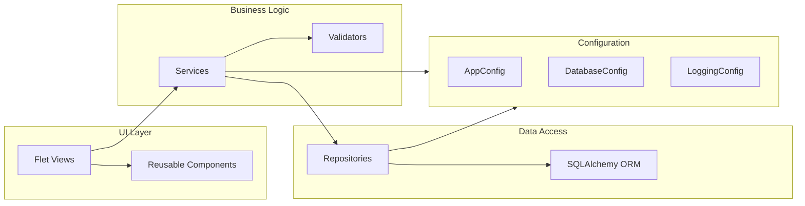
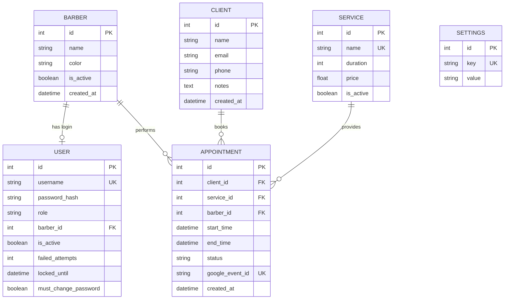
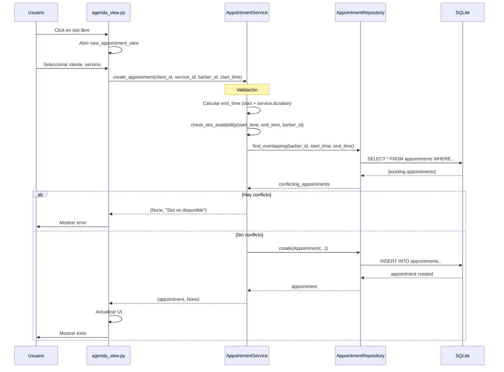
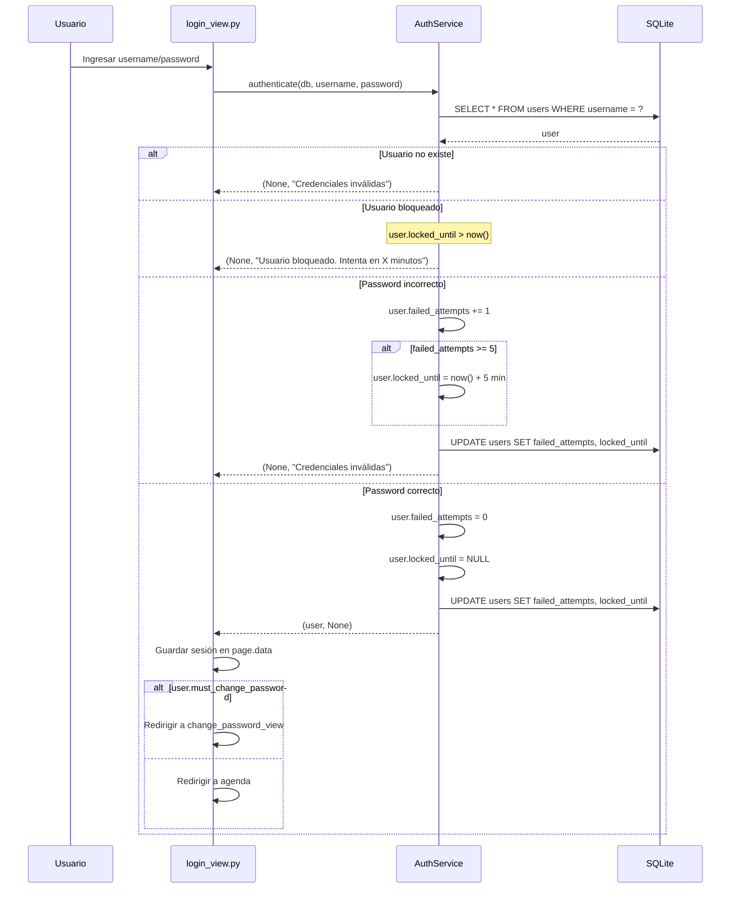

# Arquitectura del Sistema - Barber Manager Pro

Documentación técnica completa de la arquitectura, patrones de diseño y flujos de datos del sistema de gestión de turnos para barberías.

---

## Tabla de Contenidos

- [Visión General](#visión-general)
- [Diagrama de Arquitectura](#diagrama-de-arquitectura)
- [Capas del Sistema](#capas-del-sistema)
- [Flujo de Datos](#flujo-de-datos)
- [Patrones de Diseño](#patrones-de-diseño)
- [Decisiones Técnicas](#decisiones-técnicas)
- [Esquema de Base de Datos](#esquema-de-base-de-datos)
- [Stack Tecnológico](#stack-tecnológico)

---

## Visión General

Barber Manager Pro utiliza una **arquitectura en capas** basada en el patrón **MVC (Modelo-Vista-Controlador)** con la adición de dos patrones adicionales para mejorar mantenibilidad y testabilidad:

1. **Repository Pattern** - Abstracción de acceso a datos
2. **Service Layer** - Encapsulación de lógica de negocio

### Beneficios de esta Arquitectura

- ✅ **Separación clara de responsabilidades** - Cada capa tiene un propósito único
- ✅ **Alta testabilidad** - Los servicios y repositorios pueden ser testeados independientemente
- ✅ **Bajo acoplamiento** - Las capas se comunican a través de interfaces bien definidas
- ✅ **Alta cohesión** - Código relacionado está agrupado en módulos lógicos
- ✅ **Fácil mantenimiento** - Cambios en una capa no afectan a las demás
- ✅ **Escalabilidad** - Estructura preparada para crecer

---

## Diagrama de Arquitectura

### Vista de Capas

```mermaid
graph TB
    subgraph Presentation["🎨 Capa de Presentación (views/)"]
        Main[main.py<br/>Entry Point]
        Login[login_view.py]
        Agenda[agenda_view.py]
        Clients[clients_view.py]
        Barbers[barbers_view.py]
        Services[services_view.py]
        Reports[reports_view.py]
        Settings[settings_view.py]
        NewAppt[new_appointment_view.py]
        ChangePwd[change_password_view.py]
        
        Main --> Login
        Main --> Agenda
        Main --> Clients
        Main --> Barbers
        Main --> Services
        Main --> Reports
        Main --> Settings
    end
    
    subgraph ServiceLayer["🔧 Capa de Servicios (services/)"]
        ApptService[AppointmentService]
        ClientService[ClientService]
        BarberService[BarberService]
        ServiceSvc[ServiceService]
        AuthService[AuthService]
        NotifService[NotificationService]
        SettingsService[SettingsService]
    end
    
    subgraph RepositoryLayer["📦 Capa de Repositorios (repositories/)"]
        BaseRepo[BaseRepository]
        ApptRepo[AppointmentRepository]
    end
    
    subgraph DataLayer["💾 Capa de Datos (models/)"]
        Models[ORM Models<br/>SQLAlchemy]
        Barber[Barber]
        User[User]
        Client[Client]
        Service[Service]
        Appointment[Appointment]
        SettingsModel[Settings]
    end
    
    subgraph Database["🗄️ Base de Datos"]
        SQLite[(SQLite)]
    end
    
    Agenda --> ApptService
    NewAppt --> ApptService
    Clients --> ClientService
    Barbers --> BarberService
    Services --> ServiceSvc
    Login --> AuthService
    Reports --> ApptService
    Reports --> BarberService
    Reports --> ApptService
    Reports --> BarberService
    Settings --> SettingsService
    CalendarSettings[CalendarSettingsView] --> SettingsService
    CalendarSettings --> GoogleCalendarService
    
    subgraph External["☁️ Servicios Externos"]
        GCalAPI[Google Calendar API]
    end
    
    GoogleCalendarService --> GCalAPI
    ApptService --> GoogleCalendarService
    
    ApptService --> ApptRepo
    ClientService --> BaseRepo
    BarberService --> BaseRepo
    ServiceSvc --> BaseRepo
    SettingsService --> BaseRepo
    
    ApptRepo --> Models
    BaseRepo --> Models
    
    Models --> SQLite
    
    style Presentation fill:#1a1a2e
    style ServiceLayer fill:#16213e
    style RepositoryLayer fill:#0f3460
    style DataLayer fill:#533483
    style Database fill:#7e57c2
```



### Vista de Componentes



---

## Capas del Sistema

### 1. Capa de Presentación (`views/`)

**Responsabilidad**: Interfaz de usuario y manejo de eventos.

Construida con **Flet**, un framework de UI basado en Flutter que permite crear aplicaciones de escritorio con Python.

#### Componentes Principales

| Vista | Archivo | Responsabilidad |
|-------|---------|-----------------|
| **Entry Point** | `main.py` | Punto de entrada, routing, gestión de sesión |
| **Login** | `login_view.py` | Autenticación de usuarios |
| **Cambio Password** | `change_password_view.py` | Forzar cambio de contraseña en primer login |
| **Agenda** | `agenda_view.py` | Vista principal: calendario semanal, lista de turnos |
| **Nuevo Turno** | `new_appointment_view.py` | Formulario crear/editar turnos con validación |
| **Clientes** | `clients_view.py` | CRUD de clientes con búsqueda |
| **Barberos** | `barbers_view.py` | Gestión de personal, activación/desactivación |
| **Servicios** | `services_view.py` | Catálogo de servicios (nombre, duración, precio) |
| **Reportes** | `reports_view.py` | Estadísticas, arqueo de caja, desempeño |
| **Configuración** | `settings_view.py` | Horarios de atención y parámetros |

#### Componentes Reutilizables (`views/components/`)

| Componente | Propósito |
|------------|-----------|
| `sidebar.py` | Barra lateral de navegación con callback de logout |
| `appointment_card.py` | Tarjeta visual para mostrar turno |
| `time_slot.py` | Slot de tiempo en vista de agenda |

#### Características de la UI

- **Modo oscuro** (`ThemeMode.DARK`)
- **Navegación asíncrona** con `async def` y `ft.run()`
- **Gestión de estado** con `page.data` (diccionario de sesión)
- **Routing dinámico** con `page.route` y `on_route_change`
- **Feedback visual** con `SnackBar` y `AlertDialog`

---

### 2. Capa de Servicios (`services/`)

**Responsabilidad**: Lógica de negocio, validaciones y orquestación de operaciones.

Esta capa es el **corazón de la aplicación**, encapsula todas las reglas de negocio y coordina operaciones complejas.

#### Servicios Implementados

##### 📅 AppointmentService

**Responsabilidades**:
- Gestión de turnos (crear, actualizar, eliminar)
- **Detección de conflictos** de horarios
- Cálculo de disponibilidad de slots
- Validación de horarios de negocio
- Generación de agenda diaria/semanal

**Métodos clave**:
- `get_available_slots()` - Calcula slots libres considerando duración de servicio
- `check_slot_availability()` - Verifica si un horario está disponible
- `create_appointment()` - Crea turno con validación de conflictos
- `get_appointments_for_date()` - Obtiene turnos de una fecha
- `update_appointment_status()` - Cambia estado (pending/confirmed/cancelled)

**Algoritmo de detección de conflictos**:
```python
# Para cada slot propuesto (start_time, end_time):
# 1. Buscar turnos existentes del mismo barbero
# 2. Verificar si hay overlap:
#    existing.start_time < proposed.end_time AND
#    existing.end_time > proposed.start_time
# 3. Si hay overlap => conflicto
```

##### 👥 ClientService

**Responsabilidades**:
- CRUD de clientes
- Búsqueda por nombre o teléfono
- Validación de emails (formato válido, único)
- Validación de teléfonos (formato)

**Métodos clave**:
- `get_all_clients()` - Lista todos ordenados por nombre
- `search_clients()` - Búsqueda con límite de 10 resultados
- `create_client()` - Crea con validación de email único
- `update_client()` - Actualiza campos permitidos
- `delete_client()` - Elimina solo si no tiene turnos asociados

##### 💇 BarberService

**Responsabilidades**:
- CRUD de barberos
- Activación/desactivación de barberos
- Estadísticas de desempeño
- Validaciones de negocio (no desactivar último activo)

**Métodos clave**:
- `get_all_barbers()` - Lista barberos (opcional incluir inactivos)
- `create_barber()` - Crea con validación de nombre único
- `toggle_active()` - Activa/desactiva con validaciones:
  - No permitir desactivar si es el último activo
  - No permitir desactivar si tiene citas futuras
- `get_barber_stats()` - Estadísticas mensuales (citas completadas, canceladas)

##### 💼 ServiceService

**Responsabilidades**:
- CRUD de servicios (corte, barba, etc.)
- Validación de duración > 0
- Validación de nombre único

##### 🔐 AuthService

**Responsabilidades**:
- Autenticación de usuarios
- Hashing de contraseñas con **bcrypt** (10 rounds)
- **Rate limiting** (5 intentos, 5 minutos de bloqueo)
- Gestión de usuarios
- Cambio de contraseñas

**Métodos clave**:
- `hash_password()` - Genera hash bcrypt
- `verify_password()` - Verifica password contra hash
- `authenticate()` - Autenticación con rate limiting
- `create_user()` - Crea usuario con password hasheado
- `change_password()` - Cambia password y desmarca `must_change_password`
- `unlock_user()` - Desbloquea usuario manualmente (para admins)

**Mecanismo de Rate Limiting**:
```python
# En cada intento de login:
# 1. Verificar si user.locked_until > now() => rechazar
# 2. Si password incorrecto:
#    - Incrementar failed_attempts
#    - Si failed_attempts >= 5:
#      - locked_until = now() + 5 minutos
# 3. Si password correcto:
#    - failed_attempts = 0
#    - locked_until = NULL
```

##### 🔔 NotificationService

**Responsabilidades**:
- Generación de URLs de WhatsApp para recordatorios
- Formateo de mensajes personalizados

##### ⚙️ SettingsService

**Responsabilidades**:
- Gestión de configuración key-value en DB
- Horarios de atención (`business_hours_start`, `business_hours_end`)
- Parámetros configurables del sistema

##### 📅 GoogleCalendarService

**Responsabilidades**:
- Autenticación OAuth 2.0 con Google
- Gestión de tokens y credenciales
- Sincronización de eventos (Crear, Actualizar, Eliminar)
- Mapeo entre appointments locales y eventos remotos

---

### 3. Capa de Repositorios (`repositories/`)

**Responsabilidad**: Abstracción de acceso a datos, implementa el **Repository Pattern**.

Esta capa oculta los detalles de cómo se accede a los datos, permitiendo cambiar el almacenamiento sin afectar los servicios.

#### Repositorios

##### BaseRepository

**Propósito**: Repository genérico con operaciones CRUD básicas.

**Métodos**:
- `get_all()` - Lista todas las entidades
- `get_by_id()` - Obtiene por ID
- `create()` - Crea nueva entidad
- `update()` - Actualiza entidad existente
- `delete()` - Elimina entidad

**Ventajas**:
- Reduce duplicación de código
- Herencia para repositorios específicos
- Consistencia en operaciones básicas

##### AppointmentRepository

**Propósito**: Queries especializadas para turnos.

**Métodos especializados**:
- `find_by_date_range()` - Turnos en un rango de fechas
- `find_overlapping()` - Detecta turnos que se solapan con un horario
- `find_by_barber_and_date()` - Turnos de un barbero en una fecha
- `count_by_status()` - Cuenta turnos por estado

**Optimizaciones**:
- Uso de índices en consultas (ver `models/base.py`)
- Joins eficientes con relaciones ORM
- Filtrado en DB en lugar de en memoria

---

### 4. Capa de Modelos (`models/`)

**Responsabilidad**: Entidades ORM con SQLAlchemy, define el esquema de base de datos.

#### Modelos

```python
Base (DeclarativeBase)
  ├── Barber        # Barberos/empleados
  ├── User          # Usuarios del sistema (autenticación)
  ├── Client        # Clientes
  ├── Service       # Servicios ofrecidos
  ├── Appointment   # Turnos (pivot table)
  └── Settings      # Configuración key-value
```

#### Relaciones



#### Índices para Performance

Definidos en `models/base.py`:

```python
# Client
Index('idx_client_name', 'name')
Index('idx_client_phone', 'phone')

# Appointment
Index('idx_appointment_start_time', 'start_time')
Index('idx_appointment_barber_date', 'barber_id', 'start_time')
Index('idx_appointment_status', 'status')
```

**Justificación**:
- Búsqueda de clientes por nombre/teléfono es frecuente
- Consultas de turnos por fecha y barbero son constantes
- Filtrado por estado de turno usado en reportes

---

## Flujo de Datos

### Ejemplo 1: Crear Turno

Flujo completo desde que el usuario hace clic en un slot hasta que se guarda en la base de datos.



**Pasos detallados**:

1. **Usuario**: Hace clic en un slot libre en la agenda
2. **Vista**: Abre formulario de nuevo turno
3. **Usuario**: Completa datos (cliente, servicio)
4. **Vista**: Llama a `AppointmentService.create_appointment()`
5. **Servicio**: 
   - Calcula hora de fin según duración del servicio
   - Valida que el horario esté dentro del horario de negocio
   - Llama a `check_slot_availability()` para verificar conflictos
6. **Repositorio**: Consulta turnos existentes del barbero en ese rango
7. **Base de Datos**: Ejecuta query con condición de overlap
8. **Repositorio**: Retorna lista de turnos conflictivos
9. **Servicio**: Si hay conflictos, retorna error; si no, crea el turno
10. **Vista**: Actualiza UI y muestra feedback

---

### Ejemplo 2: Autenticación con Rate Limiting



---

## Patrones de Diseño

### 1. MVC (Modelo-Vista-Controlador)

**Implementación**:
- **Modelo**: `models/base.py` - Entidades ORM
- **Vista**: `views/` - UI con Flet
- **Controlador**: `services/` - Lógica de negocio (el "Controlador" es la Service Layer)

**Ventajas**:
- Separación clara entre datos, lógica y presentación
- Permite cambiar UI sin tocar lógica de negocio
- Múltiples vistas pueden usar los mismos servicios

---

### 2. Repository Pattern

**Propósito**: Abstracción de acceso a datos.

**Implementación**:
- `BaseRepository`: CRUD genérico
- `AppointmentRepository`: Queries especializadas

**Ventajas**:
- Los servicios no dependen directamente de SQLAlchemy
- Fácil cambiar de DB (SQLite → PostgreSQL)
- Testeable con mocks
- Queries centralizadas y reutilizables

**Ejemplo**:
```python
# Sin Repository Pattern (malo)
class AppointmentService:
    def get_by_id(self, db, appointment_id):
        return db.query(Appointment).filter(Appointment.id == appointment_id).first()

# Con Repository Pattern (bueno)
class AppointmentService:
    def get_by_id(self, db, appointment_id):
        return appointment_repo.get_by_id(db, appointment_id)
```

---

### 3. Service Layer

**Propósito**: Encapsular lógica de negocio compleja.

**Ventajas**:
- Lógica de negocio centralizada
- Reutilizable desde múltiples vistas
- Testeable independientemente de la UI
- Transacciones gestionadas en un solo lugar

**Ejemplo**:
```python
# Vista solo llama al servicio
appointment, error = AppointmentService.create_appointment(
    db, client_id, service_id, barber_id, start_time
)

# Servicio maneja toda la complejidad
class AppointmentService:
    @classmethod
    def create_appointment(cls, ...):
        # 1. Validar horario de negocio
        # 2. Calcular end_time
        # 3. Verificar conflictos
        # 4. Crear turno
        # 5. Manejar transacción
        # 6. Retornar resultado
```

---

### 4. Dependency Injection

**Implementación**: Sesiones de DB inyectadas como parámetros.

```python
# Mal: servicio crea su propia sesión
class AppointmentService:
    def create(...):
        db = SessionLocal()  # Acoplamiento fuerte
        ...

# Bien: sesión inyectada
class AppointmentService:
    @classmethod
    def create(cls, db: Session, ...):  # Inyección de dependencia
        ...

# Uso en vista
with get_db() as db:
    AppointmentService.create(db, ...)
```

**Ventajas**:
- Testeable (inyectar DB en memoria)
- Gestión de transacciones desde el llamador
- Flexibilidad (usar diferentes sesiones)

---

### 5. Factory Pattern

**Implementación**: `database.py` con fábrica de sesiones.

```python
SessionLocal = sessionmaker(autocommit=False, autoflush=False, bind=engine)

@contextmanager
def get_db() -> Generator[Session, None, None]:
    db = SessionLocal()  # Factory crea sesión
    try:
        yield db
        db.commit()
    except Exception:
        db.rollback()
        raise
    finally:
        db.close()
```

**Ventajas**:
- Creación consistente de sesiones
- Gestión automática de commit/rollback
- Cleanup garantizado con context manager

---

## Decisiones Técnicas

### ¿Por qué SQLite?

**Ventajas para este proyecto**:
- ✅ Sin servidor separado (embedded)
- ✅ Cero configuración
- ✅ Archivo único portable
- ✅ Perfecto para aplicación de escritorio mono-usuario
- ✅ Transacciones ACID
- ✅ Performance excelente para cargas ligeras

**Limitaciones conocidas**:
- ❌ No óptimo para múltiples escrituras concurrentes
- ❌ No recomendado para aplicación web multi-usuario

**Mitigación**: Para deployment en red, migrar a PostgreSQL (SQLAlchemy hace esto trivial).

---

### ¿Por qué Flet?

**Ventajas**:
- ✅ UI moderna y atractiva (basada en Flutter)
- ✅ Todo en Python (no HTML/CSS/JS)
- ✅ Multi-plataforma (Windows, Mac, Linux, Web)
- ✅ Desarrollo rápido
- ✅ Componentes reactivos

**Alternativas consideradas**:
- **Tkinter**: UI anticuada
- **PyQt**: Licencia restrictiva, curva de aprendizaje alta
- **Kivy**: Orientado a móviles

---

### ¿Por qué Repository Pattern?

Para un proyecto pequeño, podría parecer sobre-ingeniería. Sin embargo:

**Ventajas a largo plazo**:
- Preparado para escalar
- Código más limpio y organizado
- Tests más fáciles de escribir
- Abstracción permite cambios sin romper todo

**Ejemplo de valor**:
```python
# Sin Repository: cambiar de SQLite a PostgreSQL requiere
# modificar TODOS los servicios que hacen queries

# Con Repository: solo modificar el repositorio
# Los servicios no cambian
```

---

### ¿Por qué bcrypt y no SHA-256?

**bcrypt** es específicamente diseñado para passwords:
- ✅ Incluye salt automático
- ✅ Costoso computacionalmente (previene brute force)
- ✅ Configurable (rounds)
- ✅ Resistente a rainbow tables

**SHA-256** es para hashing general, NO para passwords:
- ❌ Muy rápido (vulnerable a brute force)
- ❌ Requiere manejo manual de salt
- ❌ No configurable

---

## Esquema de Base de Datos

Ver documentación completa en [base_de_datos.md](base_de_datos.md).

### Resumen de Tablas

| Tabla | Propósito | Claves |
|-------|-----------|--------|
| `barbers` | Personal de la barbería | PK: id |
| `users` | Autenticación | PK: id, UK: username, FK: barber_id |
| `clients` | Base de clientes | PK: id |
| `services` | Catálogo de servicios | PK: id, UK: name |
| `appointments` | Turnos agendados | PK: id, FK: client_id, service_id, barber_id |
| `settings` | Configuración key-value | PK: id, UK: key |

---

## Stack Tecnológico

### Lenguaje y Runtime

| Tecnología | Versión | Uso |
|------------|---------|-----|
| **Python** | 3.10+ | Lenguaje principal |

### Framework UI

| Tecnología | Versión | Uso |
|------------|---------|-----|
| **Flet** | 0.80.1 | Framework de interfaz de usuario |

### Base de Datos

| Tecnología | Versión | Uso |
|------------|---------|-----|
| **SQLite** | 3.x | Base de datos embedded |
| **SQLAlchemy** | 2.0.25 | ORM (Object-Relational Mapping) |
| **Alembic** | 1.13.1 | Migraciones de esquema |

### Seguridad

| Tecnología | Versión | Uso |
|------------|---------|-----|
| **bcrypt** | 4.1.2 | Hashing de contraseñas |
| **cryptography** | 41.0.0+ | Funciones criptográficas |

### Utilidades

| Tecnología | Versión | Uso |
|------------|---------|-----|
| **python-dotenv** | 1.0.0+ | Carga de variables de entorno |

### Integraciones Futuras

| Tecnología | Versión | Uso |
|------------|---------|-----|
| **google-api-python-client** | 2.100.0+ | Google Calendar API (stub implementado) |
| **google-auth** | 2.23.0+ | Autenticación con Google |

### Testing

| Tecnología | Versión | Uso |
|------------|---------|-----|
| **pytest** | Latest | Framework de testing |
| **pytest-cov** | Latest | Cobertura de código |

---

## Conclusión

La arquitectura de Barber Manager Pro está diseñada para ser:

- **Mantenible**: Código organizado, separación clara de responsabilidades
- **Testeable**: Cada capa puede ser testeada independientemente
- **Escalable**: Preparada para crecer con nuevas features
- **Segura**: Múltiples capas de validación y seguridad
- **Documentada**: Cada decisión técnica tiene justificación

Esta arquitectura permite que el proyecto evolucione sin acumular deuda técnica, facilitando la adición de nuevas funcionalidades como sincronización con Google Calendar, multi-sede, o migración a arquitectura web.

---

**📚 Documentación Relacionada**:
- [Base de Datos](base_de_datos.md) - Esquema detallado
- [API Interna](api_interna.md) - Documentación de servicios
- [Guía de Desarrollo](guia_desarrollo.md) - Cómo extender el proyecto
- [Seguridad](seguridad.md) - Aspectos de seguridad
