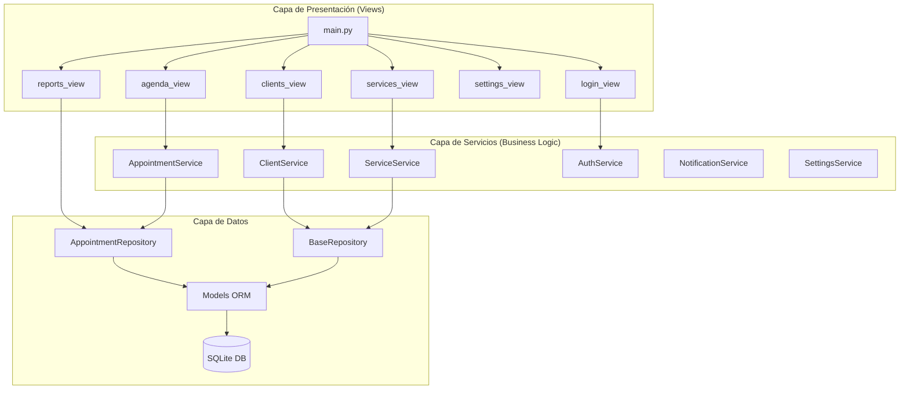
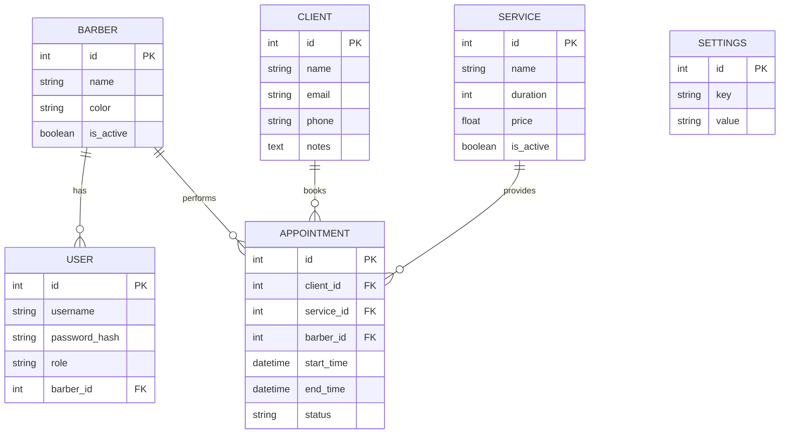

# Arquitectura del Sistema

## Visión General

Barber Manager Pro utiliza una arquitectura en capas basada en el patrón MVC (Modelo-Vista-Controlador) con la adición del patrón Repository para el acceso a datos.

## Diagrama de Arquitectura



## Capas del Sistema

### 1. Capa de Presentación (`views/`)
Construida con **Flet**, maneja toda la interfaz de usuario.

| Componente | Responsabilidad |
|------------|-----------------|
| `main.py` | Punto de entrada, enrutamiento |
| `agenda_view.py` | Calendario semanal, lista de turnos |
| `clients_view.py` | CRUD de clientes |
| `reports_view.py` | Estadísticas, arqueo de caja |
| `services_view.py` | Catálogo de servicios |
| `login_view.py` | Autenticación |

### 2. Capa de Servicios (`services/`)
Contiene toda la **lógica de negocio**.

| Servicio | Responsabilidad |
|----------|-----------------|
| `AppointmentService` | Gestión de turnos, disponibilidad |
| `ClientService` | CRUD de clientes, búsqueda |
| `ServiceService` | CRUD de servicios |
| `AuthService` | Autenticación, hash de passwords |
| `NotificationService` | Recordatorios WhatsApp |
| `SettingsService` | Configuración de la aplicación |

### 3. Capa de Repositorios (`repositories/`)
Implementa el **patrón Repository** para abstracción del acceso a datos.

| Repositorio | Responsabilidad |
|-------------|-----------------|
| `BaseRepository` | CRUD genérico |
| `AppointmentRepository` | Consultas optimizadas de turnos |

### 4. Capa de Modelos (`models/`)
Define las **entidades ORM** con SQLAlchemy.

| Modelo | Descripción |
|--------|-------------|
| `Barber` | Barbero/empleado |
| `User` | Usuario del sistema |
| `Client` | Cliente |
| `Service` | Servicio ofrecido |
| `Appointment` | Turno agendado |
| `Settings` | Configuración clave-valor |

## Flujo de Datos

```
Usuario → Vista → Servicio → Repositorio → Base de Datos
                    ↓
              Validadores (utils/)
```

### Ejemplo: Crear Turno

1. Usuario selecciona fecha/hora en `agenda_view`
2. Vista llama a `AppointmentService.create_appointment()`
3. Servicio valida disponibilidad con `check_slot_availability()`
4. Repositorio verifica conflictos con `find_overlapping()`
5. Si está disponible, se crea el turno y se persiste
6. Vista actualiza la UI

## Patrones Utilizados

| Patrón | Ubicación | Propósito |
|--------|-----------|-----------|
| **MVC** | Global | Separación de responsabilidades |
| **Repository** | `repositories/` | Abstracción de acceso a datos |
| **Service Layer** | `services/` | Encapsulación de lógica de negocio |
| **Dependency Injection** | Sesiones DB | Flexibilidad y testabilidad |
| **Factory** | `database.py` | Creación de sesiones |

## Base de Datos

### Esquema ER



## Tecnologías

| Tecnología | Versión | Uso |
|------------|---------|-----|
| Python | 3.10+ | Lenguaje principal |
| Flet | 0.80+ | Framework UI |
| SQLAlchemy | 2.0+ | ORM |
| SQLite | 3 | Base de datos |
| bcrypt | 4.0+ | Hash de passwords |
| Alembic | 1.12+ | Migraciones |
